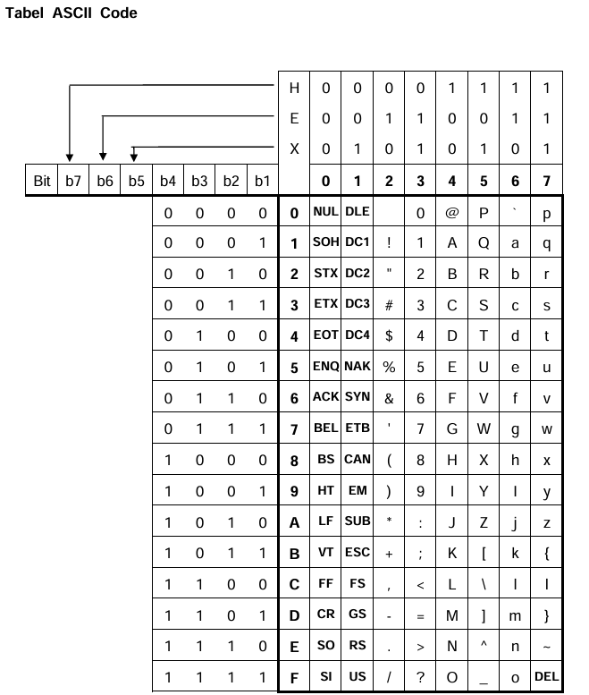

LAPORAN SISTEM OPERASI

**TUGAS KE -- 1 LATIHAN PENGENALAN SISTEM BILANGAN**

{width="2.2in" height="2.2083333333333335in"}

> Nama : Fandra Salsabilla Oktorasari
>
> NRP : 3124500040
>
> Dosen Pengajar : Dr Ferry Astika Saputra ST, M.Sc
>
> **PROGRAM STUDI D3 TEKNIK INFORMATIKA POLITEKNIK ELEKTRONIKA NEGERI
> SURABAYA (PENS) TAHUN 2024**

1.  Bilangan biner adalah bilangan yang berbasis dua (2)

Bilangan heksadesimal adalah bilangan yang berbasis enam belas (16)

2.  Konversikan bilangan desimal di bawah ini ke dalam bilangan biner

    a.  1234~10~

> 1234 : 2 = 617 sisa 0
>
> 617 : 2 = 308 sisa 1
>
> 308 : 2 = 154 sisa 0
>
> 154 : 2 = 77 sisa 0
>
> 77 : 2 = 38 sisa 1
>
> 38 : 2 = 19 sisa 0
>
> 19 : 2 = 9 sisa 1
>
> 9 : 2 = 4 sisa 1
>
> 4 : 2 = 2 sisa 0
>
> 2 : 2 = 1 sisa 0
>
> 1 : 2 = 0 sisa 1
>
> Hasilnya 10011010010~2~

b.  5670~10~

> 5670 : 2 = 2835 sisa 0
>
> 2835 : 2 = 1417 sisa 1
>
> 1417 : 2 = 708 sisa 1
>
> 708 : 2 = 354 sisa 0
>
> 354 : 2 =177 sisa 0
>
> 177 : 2 = 88 sisa 1
>
> 88 : 2 = 44 sisa 0
>
> 44 : 2 = 22 sisa 0
>
> 22 : 2 = 11 sisa 0
>
> 11 : 2 = 5 sisa 1
>
> 5 : 2 = 2 sisa 1
>
> 2 : 2 = 1 sisa 0
>
> 1 : 2 = 0 sisa 1
>
> Hasilnya 1011000100110~2~

c.  2321~10~

> 2321 : 2 = 1160 sisa 1
>
> 1160 : 2 = 580 sisa 0
>
> 580 : 2 = 290 sisa 0
>
> 290 : 2 = 145 sisa 0
>
> 145 : 2 = 72 sisa 1
>
> 72 : 2 = 36 sisa 0
>
> 36 : 2 = 18 sisa 0
>
> 18 : 2 = 9 sisa 0
>
> 9 : 2 = 4 sisa 1
>
> 4 : 2 = 2 sisa 0
>
> 2 : 2 = 1 sisa 0
>
> 1 : 2 = 0 sisa 1
>
> Hasil 100100010001~2~

3.  Konversikan bilangan biner di bawah ini ke dalam bilangan decimal

    a.  10101010

        -   1 . 2^7^ + 0 . 2^6^ + 1 . 2^5^ + 0 . 2^4^ + 1 . 2^3^ + 0 .
            > 2^2^ + 1 . 2^1^ + 0 . 2^0^

        -   = 128 + 0 + 32 + 0 + 8 + 0 + 2 + 0

        -   = 170

    b.  01010101

        -   0 . 2^7^ + 1 . 2^6^ + 0 . 2^5^ + 1 . 2^4^ + 0 . 2^3^ + 1 .
            > 2^2^ + 0 . 2^1^ + 1 . 2^0^

        -   = 0 + 64 + 0 + 16 + 0 + 4 + 0 + 1

        -   = 85

    c.  11001100

        -   1 . 2^7^ + 1 . 2^6^ + 0 . 2^5^ + 0 . 2^4^ + 1 . 2^3^ + 1 .
            > 2^2^ + 0 . 2^1^ + 0 . 2^0^

        -   = 128 + 64 + 0 + 0 + 8 + 4 + 0 + 0

        -   = 204

    d.  10011111

        -   1 . 2^7^ + 0 . 2^6^ + 0 . 2^5^ + 1 . 2^4^ + 1 . 2^3^ + 1 .
            > 2^2^ + 1 . 2^1^ + 1 . 2^0^

        -   = 128 + 0 + 0 + 16 + 8 + 4 + 2 + 1

        -   = 159

4.  Konversikan bilangan biner di bawah ini ke dalam bilangan oktal

    a.  1 0 1 0 1 1 1 1 1 0 0 1~2~

> 0 0 1 = 1 oktal
>
> 1 1 1 = 7 oktal
>
> 0 1 1 = 3 oktal
>
> 1 0 1 = 5 oktal
>
> Hasilnya 5371~8~

b.  1 1 0 0 1 0 1 1 0 1 1 1~2~

> 1 1 1 = 7 oktal
>
> 1 1 0 = 6 oktal
>
> 0 1 0 = 2 oktal
>
> 1 1 0 = 6 oktal
>
> Hasilnya 6267~8~

5.  Konversikan bilangan oktal di bawah ini ke dalam bilangan biner

    a.  2170~8~

> 0 = 000
>
> 7 = 111
>
> 1 = 001
>
> 2 = 010
>
> Hasilnya 010 001 111 000~2~

b.  3571~8~

> 1 = 001
>
> 7 = 111
>
> 5 = 101
>
> 3 = 011
>
> Hasilnya 011 101 111 001~2~

6.  Konversikan bilangan desimal di bawah ini ke dalam bilangan
    heksadesimal

    a.  1780~10~

> 1780 : 16 = 111 sisa 4
>
> 111 : 16 = 6 sisa15 = F
>
> 6 : 16 = 0 sisa 6
>
> Hasilnya 6F4~16~

b.  3666~10~

> 3666 : 16 = 229 sisa 2
>
> 229 : 16 = 14 sisa 5
>
> 14 : 16 = 0 sisa 14 = E
>
> Hasilnya E52~16~

c.  5230~10~

> 5230 : 16 = 326 sisa 14 = E
>
> 326 : 16 = 20 sisa 6
>
> 20 : 16 = 1 sisa 4
>
> 1 : 16 = 0 sisa 1
>
> Hasilnya 146E~16~

d.  6744~10~

> 6744 : 16 = 421 sisa 8
>
> 421 : 16 = 26 sisa 5
>
> 26 : 16 = 1 sisa 10 = A
>
> 1 : 16 = 0 sisa 1
>
> Hasilnya 1A58~16~

7.  Konversikan bilangan heksadesimal di bawah ini ke dalam bilangan
    decimal

    a.  ABCD~16~

        -   A = 10, B = 11, C = 12, D = 13

        -   10 . 16^3^ + 11 . 16^2^ + 12 . 16^1^ + 13 . 16^0^

        -   10 . 4096 + 11 . 256 + 12 . 16 + 13 . 1

        -   40960 + 2816 + 192 + 13

        -   = 43981~10~

    b.  2170~16~

        -   2 . 16^3^ + 1 . 16^2^ + 7 . 16^1^ + 0 . 16^0^

        -   2 . 4096 + 1 . 256 + 7 . 16 + 0 . 1

        -   8192 + 256 + 112 + 0

        -   = 8560~10~

    c.  B75F~16~

        -   B = 11, 7, 5. F = 15

        -   11 . 16^3^ + 7 . 16^2^ + 5 . 16^1^ + 15 . 16^0^

        -   11 . 4096 + 7 . 256 + 5 . 16 + 15 . 1

        -   40960 + 2816 + 192 + 13

        -   = 46943~10~

    d.  EBED~16~

        -   E = 14, B = 11, E = 14, D = 13

        -   14 . 16^3^ + 11 . 16^2^ + 14 . 16^1^ + 13 . 16^0^

        -   14 . 4096 + 11 . 256 + 14 . 16 + 13 . 1

        -   57344 + 2816 + 224 + 13

        -   = 60397~10~

8.  Konversikan bilangan pecahan desimal di bawah ini ke dalam bilangan
    biner

    a.  0,3125~10~

> 0,3125 . 2 = 0 sisa 0,625
>
> 0,625 . 2 = 1 sisa 0,25
>
> 0,25 . 2 = 0 sisa 0,5
>
> 0,5 . 2 = 1 sisa 0
>
> Hasilnya 0,0101~2~

b.  0,65625~10~

> 0,65625 . 2 = 1 sisa 0,3125
>
> 0,3125 . 2 = 0 sisa 0,625
>
> 0,625 . 2 = 1 sisa 0,25
>
> 0,25 . 2 = 0 sisa 0,5
>
> 0,5 . 2 = 1 sisa 0
>
> Hasilnya 0,10101~2~

c.  0,34375~10~

> 0,34375 . 2 = 0 sisa 0,6875
>
> 0,6875 . 2 = 1 sisa 0,375
>
> 0,375 . 2 = 0 sisa 0,75
>
> 0,75 . 2 = 1 sisa 0,5
>
> 0,5 . 2 = 1 sisa 0
>
> Hasilnya 0,01011~2~

d.  0,140625~10~

> 0,140625 . 2 = 0 sisa 0,28125
>
> 0,28125 . 2 = 0 sisa 0,5625
>
> 0,5625 . 2 = 1 sisa 0,125
>
> 0,125 . 2 = 0 sisa 0,25
>
> 0,25 . 2 = 0 sisa 0,5
>
> 0,5 . 2 = 1 sisa 0
>
> Hasilnya 0,001001~2~

9.  Konversikan bilangan desimal di bawah ini ke dalam bilangan biner

    a.  11,625~10~

> 11 : 2 = 5 sisa 1
>
> 5 : 2 = 2 sisa 1
>
> 2 : 2 = 1 sisa 0
>
> 1 : 2 = 0 sisa 1
>
> Hasil 1011
>
> 0,625 . 2 = 1 sisa 0,25
>
> 0,25 . 2 = 0 sisa 0,5
>
> 0,5 . 2 = 1 sisa 0
>
> Hasilnya 1011,101~2~

b.  0,6875~10~

> 0,6875 . 2 = 1 sisa 0,375
>
> 0,375 . 2 = 0 sisa 0,75
>
> 0,75 . 2 = 1 sisa 0,5
>
> 0,5 . 2 = 1 sisa 0
>
> Hasilnya 0,1011~2~

c.  0,75~10~

> 0,75 . 2 = 1 sisa 0,5
>
> 0,5 . 2 = 1 sisa 0
>
> Hasilnya 0,11~2~

d.  25,75~10~

> 25 : 2 = 12 sisa 1
>
> 12 : 2 = 6 sisa 0
>
> 6 : 2 = 3 sisa 0
>
> 3 : 2 = 1 sisa 1
>
> 1 : 2 = 0 sisa 1
>
> Hasil 11001
>
> 0,75 . 2 = 1 sisa 0,5
>
> 0,5 . 2 = 1 sisa 0
>
> Hasilnya 11001,11~2~

10. Konversikan bilangan desimal di bawah ini ke dalam bilangan
    heksadesimal

    a.  348,654~10~

> 348 : 16 = 21 sisa 12 = C
>
> 21 : 16 = 1 sisa 5
>
> 1 : 16 = 0 sisa 1
>
> Hasil 15C
>
> 0,654 . 16 = 10 (A) sisa 0,464
>
> 0,464 . 16 = 7 sisa 0,424
>
> 0,424 . 16 = 6 sisa 0,784
>
> 0,784 . 16 = 12 (C) sisa 0,544
>
> Hasilnya 15C,A76C~16~

b.  1784,240~10~

> 1784 : 16 = 111 sisa 8
>
> 111 : 16 = 6 sisa 15 (F)
>
> 6 : 16 = 0 sisa 6
>
> Hasil 6F8
>
> 0,240 . 16 = 3 sisa 0,840
>
> 0,840 . 16 = 13 (D) sisa 0,440
>
> 0,440 . 16 = 7 sisa 0,040
>
> 0,040 . 16 = 0 sisa 0,640
>
> Hasilnya 6F8,3D70~16~

11. Konversikan bilangan di bawah ini ke dalam bilangan decimal

    a.  010100011,001111101~2~

        -   0 . 2^8^ + 1 . 2^7^ + 0 . 2^6^ + 1 . 2^5^ + 0 . 2^4^ + 0 .
            > 2^3^ + 0 . 2^2^ + 1 . 2^1^ + 1 . 2^0^

        -   = 0 + 128 + 0 + 32 + 0 + 0 + 0 + 2 + 1

        -   = 163

        -   0 . 2^-1^ + 0 . 2^-2^ + 1 . 2^-3^ + 1 . 2^-4^ + 1 . 2^-5^ +
            > 1 . 2^-6^ + 1 . 2^-7^ + 0 . 2^-8^ + 1 . 2^-9^

        -   = 0 + 0 + 0,125 + 0,0625 + 0,03125 + 0,015625 + 0,0078125 +
            > 0 + 0,001953125

        -   = 0,244140625

> Hasilnya 163,244140625~10~

b.  654,276~8~

    -   6 . 8^2^ + 5 . 8^1^ + 4 . 8^0^

    -   = 6 . 64 + 5 . 8 + 4 . 1

    -   = 384 + 40 + 4

    -   = 428

    -   2 . 8^-1^ + 7 . 8^-2^ + 6 . 8^-3^

    -   = 2 . 0,125 + 7 . 0,015625 + 6 . 0,001953125

    -   = 0,25 + 0,109375 + 0,01171875

    -   = 0,37109375~10~

c.  4C5,2B8~16~

    -   C = 12, B = 11

    -   4 . 16^2^ + 12 . 16^1^ + 5 . 16^1^

    -   = 2 . 0,256 + 12 . 16 + 5 .1

    -   = 1024 + 192 + 5

    -   = 1221

    -   2 . 16^-1^ + 11 . 16^-2^ + 8 . 16^-3^

    -   = 2 . 0,0625 + 11 . 0,00390625 + 8 . 0,000244140625

    -   = 0,125 + 0,04296875 + 0,001953125

    -   = 0,169921875

> Hasilnya 1221,169921875~10~

12. Rubahlah bilangan biner di bawah ini ke dalam bentuk BCD

    a.  10100110000111~2~

> 0111 = 7
>
> 1000 = 8
>
> 1001 = 9
>
> 0010 = 2
>
> Hasilnya 2987

b.  1010101100011~2~

> 0011 = 3
>
> 0110 = 6
>
> 0101 = 5
>
> 0001 = 1
>
> Hasilnya 1563

13. Rubahlah bentuk BCD di bawah ini ke dalam bilangan biner

    a.  1987

> 7 = 0111
>
> 8 = 1000
>
> 9 = 1001
>
> 1 = 0001
>
> Hasilnya 0001100110000111~2~

b.  2346

> 6 = 0110
>
> 4 = 0100
>
> 3 = 0011
>
> 2 = 0010
>
> Hasilnya 0010001101000110~2~

c.  501

> 1 = 0001
>
> 0 = 0000
>
> 5 = 0101
>
> Hasilnya 010100000001~2~

14. Rubahlah bilangan biner di bawah ini ke dalam BCO

    a.  11111101001~2~

> 001 = 1
>
> 101 = 5
>
> 111 = 7
>
> 011 = 3
>
> Hasilnya 3751~8~

b.  101110010100~2~

> 100 = 4
>
> 010 = 2
>
> 110 = 6
>
> 101 = 5
>
> Hasilnya 5624~8~

c.  1100000010~2~

> 010 = 2
>
> 000 = 0
>
> 100 = 4
>
> 001 = 1
>
> Hasilnya 1402~8~

15. Rubahlah bilangan biner di bawah ini ke dalam BCH

    a.  1101111100101110~2~

> 1110 = 14 = E
>
> 0010 = 2
>
> 1111 = 15 = F
>
> 1101 = 13 = D
>
> Hasilnya DF2E~8~

b.  110100110000001~2~

> 0001 = 1
>
> 1000 = 8
>
> 1001 = 9
>
> 0110 = 6
>
> Hasilnya 6981~8~

16. Rubahlah Bentuk BCH di bawah ini ke dalam bilangan heksadesimal \*

    a.  F0DE

> E = 14 = 1110
>
> D = 13 = 1101
>
> 0 = 0000
>
> F = 15 = 1111
>
> Hasilnya 1111 0000 1101 1110~16~

b.  1CAB

> B = 11 = 1011
>
> A = 10 = 1010
>
> C = 12 = 1100
>
> 1 = 0001
>
> Hasilnya 0001 1100 1010 1011~16~

c.  834

> 4 = 0100
>
> 3 = 0011
>
> 8 = 1000
>
> Hasilnya 1000 0011 0100~16~

17. Nyatakan positip atau negatip bilangan biner di bawah ini

    a.  01111111

        -   0 . (-1) . 2^7^ + 1 . 2^6^ + 1 . 2^5^ + 1 . 2^4^ + 1 .
            > 2^3^ + 1 . 2^2^ + 1 . 2^1^ + 1 . 2^0^

        -   = 0 + 64 + 32 + 16 + 8 + 4 + 2 + 1

        -   = positip 127

    b.  10000000

        -   1 . (-1) . 2^7^ + 0 . 2^6^ + 0 . 2^5^ + 0 . 2^4^ + 0 .
            > 2^3^ + 0 . 2^2^ + 0 . 2^1^ + 0 . 2^0^

        -   = -128 + 0 + 0 + 0 + 0 + 0 + 0 + 0

        -   = negatip 128

    c.  01111011

        -   0 . (-1) . 2^7^ + 1 . 2^6^ + 1 . 2^5^ + 1 . 2^4^ + 1 .
            > 2^3^ + 0 . 2^2^ + 1 . 2^1^ + 1 . 2^0^

        -   = 0 + 64 + 32 + 16 + 8 + 0 + 2 + 1

        -   = positip 123

18. Nyatakan bilangan biner negatip di bawah ini ke dalam bilangan
    decimal

    a.  10001000

        -   1 . (-1) . 2^7^ + 0 . 2^6^ + 0 . 2^5^ + 0 . 2^4^ + 1 .
            > 2^3^ + 0 . 2^2^ + 0 . 2^1^ + 0 . 2^0^

        -   = -128 + 0 + 0 + 0 + 8 + 0 + 0 + 0

        -   = negatip 120

    b.  11110111

        -   1 . (-1) . 2^7^ + 1 . 2^6^ + 1 . 2^5^ + 1 . 2^4^ + 0 .
            > 2^3^ + 1 . 2^2^ + 1 . 2^1^ + 1 . 2^0^

        -   = -128 + 64 + 32 + 16 + 0 + 4 + 2 + 1

        -   = negatip 8

    c.  10000101

        -   1 . (-1) . 2^7^ + 0 . 2^6^ + 0 . 2^5^ + 0 . 2^4^ + 0 .
            > 2^3^ + 1 . 2^2^ + 0 . 2^1^ + 1 . 2^0^

        -   = -128 + 0 + 0 + 0 + 0 + 4 + 0 + 1

        -   = negatip 123

    d.  10011100

        -   1 . (-1) . 2^7^ + 0 . 2^6^ + 0 . 2^5^ + 0 . 2^4^ + 0 .
            > 2^3^ + 0 . 2^2^ + 0 . 2^1^ + 0 . 2^0^

        -   = -128 + 0 + 0 + 0 + 0 + 0 + 0 + 0

        -   = negatip 128

19. Nyatakan ASCII Code di bawah ini dalam bentuk karakter

    a.  41~16~

> 4 = 100 (sumbu X)
>
> 1 = 0001 (sumbu Y)
>
> Hasilnya adalah A

b.  5A~16~

> 5 = 101 (sumbu X)
>
> A = 1010 (sumbu Y)
>
> Hasilnya Z

c.  24~16~

> 2 = 010 (sumbu X)
>
> 4 = 0100 (sumbu Y)
>
> Hasilnya \$

d.  77~16~

> 7 = 111 (sumbu X)
>
> 7 = 0111(sumbu Y)
>
> Hasilnya w

20. Nyatakan Karakter di bawah ini dalam ASCII Code

    a.  a

> sumbu X = 110 = 6
>
> sumbu Y = 0001 = 1
>
> Hasilnya 110 0001 (61~16~)

b.  x

> sumbu X = 111 = 7
>
> sumbu Y = 1000 = 8
>
> Hasilnya 111 1000 (78~16~)

c.  m

> sumbu X = 110 = 6
>
> sumbu Y = 1101 = D
>
> Hasilnya 110 1101 (6D~16~)

d.  H

> sumbu X = 100 = 4
>
> sumbu Y = 1000 = 8
>
> Hasilnya 100 1000 (48~16~)

21. Dengan Keyboard standard ASCII, pada layar monitor nampak tulisan
    sebagai berikut

PRINT X

Nyatakan Keluaran pada Keyboard tersebut.

{width="6.268055555555556in"
height="7.3902777777777775in"}

P

sumbu X = 101 = 5

sumbu Y = 0000 = 0

Hasil 101 0000 (50~16~)

R

sumbu X = 101 = 5

sumbu Y = 0010 = 2

Hasil 101 0010 (52~16~)

I

sumbu X = 100 = 4

sumbu Y = 1001 = 9

Hasil 100 1001 (49~16~)

N

sumbu X = 100 = 4

sumbu Y = 1110 = 14 = E

Hasil 100 1110 (4E~16~)

T

sumbu X = 101 = 5

sumbu Y = 0100 = 4

Hasil 101 0100 (54~16~)

(spasi)

sumbu X = 010 = 2

sumbu Y = 0000 = 0

Hasil 010 0000 (20~16~)

X

sumbu X = 101 = 5

sumbu Y = 1000 = 8

Hasil 101 1000 (58~16~)

Hasil akhir 1010000 1010010 1001001 1001110 1010100 0100000 1011000

50 52 49 4E 54 20 58
