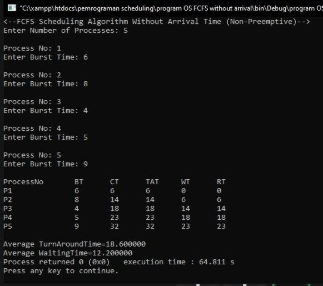

LAPORAN SISTEM OPERASI

**TUGAS CHAPTER 4: LINK REPOSITORY**
\***

` `******
\***

Disusun oleh:

Fandra Salsabilla Oktorasari 	(3124500040)

Wina Rahmalia 			(3124500052)

Virda Septina Putri 			(3124500058)

Dosen Pengajar  	: Dr Ferry Astika Saputra ST, M.Sc

**PROGRAM STUDI D3 TEKNIK INFORMATIKA**

**POLITEKNIK ELEKTRONIKA NEGERI SURABAYA (PENS)**

**TAHUN 2024**

FCFS scheduling with arrival time

Proses mengeksekusi sesuai dengan urutan kedatangannya (Arrival Time).

Proses pertama (P1)

AT (Arrival Time) : 0 → langsung dijalankan

BT (Burst Time): 5 → CT (Completion Time)  = 0 + 5 = 5

TAT (Turnaround Time) = CT (Completion Time) - AT = 5 - 0 = 5

WT (Waiting Time) = TAT (Turnaround Time)  - BT (Burst Time)= 5 - 5 = 0

RT (Response Time) = WT (Waiting time) = 0

Proses kedua (P2)

AT (Arrival Time) : 1 (sudah datang sebelum P1 selesai)

BT (Burst Time) : 6 → CT (Completion Time)  = 5 + 6 = 11

TAT (Turnaround Time) = 11 - 1 = 10

WT (Waiting Time)  = 10 - 6 = 4

RT (Response Time) =  4

Proses ketiga (P3)

AT (Arrival Time) : 4 (sudah datang sebelum P2 selesai)

BT (Burst Time) = 8 → CT (Completion Time)  =11 + 8 = 19

TAT (Turnaround Time) = 19 - 4 = 15

WT (Waiting Time) = 15 - 8 =7

RT (Response Time) = 7

Proses keempat (P4)

AT (Arrival Time) : 6 → CT = 19 + 9 = 28

TAT (Turnaround Time) = 28 - 6  = 22

WT (Waiting Time) = 22 - 9 = 13

RT (Response Time) = 13

Proses kelima (P5)

AT (Arrival Time) : 7 → CT= 28 + 10 = 38

TAT (Turnaround Time) = 38 - 7 = 31

WT (Waiting Time) = 31 - 10

RT (Response Time) = 21 

**Average Turnaround Time**

( 5 + 10 + 15 + 22 + 31) / 5 = 16.6

**Average Waiting Time**

( 0 + 4 + 7 +13 + 21 ) / 5 = 9.0

Proses yang datang lebih dulu mendapat prioritas penuh hingga selesai.

Waktu respons = waktu tunggu (Karena proses tidak di-preempt (dimasukkan ke dalam antrian) saat dijalankan).

FCFS Scheduling without arrival time

Pada output di atas menggambarkan FCFS dengan 5 proses.

Memiliki burst time (BT) sebagai berikut.

P1 = 6

P2 = 8

P3 = 4

P4 = 5

P5 = 9

Dan waktu kedatangan  nol untuk semua proses. Proses yang sedang berjalan tidak dapat diinterupsi hingga selesai. Berdasarkan tabel di atas, proses dieksekusi secara berurutan sesuai input yaitu P1 → P2 → P3 → P4 → P5.

Kemudian completion time (CT) dihitung secara kumulatif, yaitu sebagai berikut.

- P1 selesai pada waktu 6
- P2 pada 6 + 8 = 14
- P3 pada 14 + 4 = 18
- P4 pada 18 + 5 = 23
- P5 pada 23 + 9 = 32

Turnaround time (TAT) merupakan selisih completion time (CT) dan waktu kedatangan (0), sehingga TAT untuk P1 hingga P5 berturut - turut adalah 6, 14, 18, 23, dan 32.

Waiting time (WT) diperoleh dari hasil: TAT - BT

Berikut hasil dari WT tiap proses.

P1 = 6 - 6 = 0

P2 = 14 - 8 = 18

P4 = 18 + 5 = 23

P5 = 23 + 9 = 32

Turnaround Time (TAT):

TAT = CT - AT

Karena AT = 0, maka TAT = CT:

P1 = 6

P2 = 14

P3 = 18

P4 = 23

P5 = 32

Waiting Time (WT):
WT = TAT - BT:

P1 = 6 - 6 = 0

P2 = 14 - 8 = 6

P3 = 18 - 4 = 14

P4 = 23 - 5 = 18

P5 = 32 - 9 = 23

**Average Turnaround Time**

( 6 + 14 + 18 + 23 + 32) / 5 = 18,6

**Average Waiting Time**

( 0 + 6 + 14 +18 + 23 ) / 5 = 12,2
