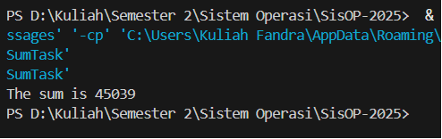
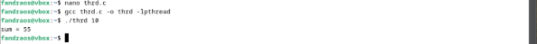
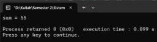

LAPORAN SISTEM OPERASI

**TUGAS CHAPTER 4: PROGRAMMING EXERCISE**

Nama	: Fandra Salsabilla Oktorasari

NRP	: 3124500040

Dosen Pengajar	: Dr Ferry Astika Saputra ST, M.Sc

**PROGRAM STUDI D3 TEKNIK INFORMATIKA** 

**POLITEKNIK ELEKTRONIKA NEGERI SURABAYA (PENS)** 

**TAHUN 2024**

Kerjakan Programming Exercise a. Penerapan thread pada contoh SumTask.java b. penerapan Thread di Linux (thrd-posix.c) dan penerapan thread di Microsoft Windows (thrd-win32.c) . Beri penjelasan dalam bentuk esay. Gunakan Link <https://github.com/ferryastika/osc10e/tree/master/ch4>

1. Penerapan thread pada contoh SumTask.java

   

   1. Kelas ‘SumTask’ dan Peran ‘RecursiveTask’ 

Kode ini dibangun di sekitar kelas ‘SumTask’, yang mewarisi ‘RecursiveTask<Integer>‘. ‘RecursiveTask’ adalah bagian dari framework Fork/Join di Java yang dirancang untuk tugas divide and conquer. Dengan mewarisi kelas ini, ‘SumTask’ wajib mengimplementasikan metode ‘compute()’ yang menjadi tempat logika pembagian dan perhitungan. 

Poin Kunci: 

- ‘RecursiveTask<Integer>‘: Menandakan bahwa tugas ini menghasilkan nilai integer setelah selesai. 
- ‘SumTask(int begin, int end, int[] array)’: Konstruktor yang menentukan rentang indeks array (‘begin’ hingga ‘end’) yang akan dihitung. 

Penjelasan Alur: 

Kelas ini bertindak seperti "kontainer" untuk tugas yang akan dibagi. Misalnya, saat pertama kali dibuat di ‘main()’, tugas utama memiliki rentang ‘0’ hingga ‘9999’. Ketika tugas ini dibagi, dua objek ‘SumTask’ baru akan dibuat untuk rentang yang lebih kecil (misalnya ‘0-4999’ dan ‘5000-9999’). Proses ini terus berulang secara rekursif hingga ukuran tugas memenuhi kriteria ‘THRESHOLD’.

1. Variabel ‘SIZE’ dan ‘THRESHOLD’: Penentu Skala dan Efisiensi 

Variabel ‘SIZE = 10000’ dan ‘THRESHOLD = 1000’ adalah dua parameter kritis dalam kode ini. 

Poin Kunci: 

- ‘SIZE’: Menentukan ukuran array yang akan dihitung. 
- ‘THRESHOLD’: Batas maksimal ukuran tugas yang boleh dikerjakan langsung tanpa dibagi. 

Penjelasan Alur: 

‘THRESHOLD’ berfungsi seperti "garis batas" untuk menentukan kapan tugas harus dibagi atau langsung dihitung. Misalnya, jika ‘THRESHOLD’ diatur ke ‘1000’, setiap tugas dengan rentang indeks lebih dari ‘1000’ elemen akan dibagi dua. Nilai ini memengaruhi efisiensi paralelisme: 

- Jika ‘THRESHOLD’ terlalu besar (misal ‘5000’), tugas tidak cukup terpecah, sehingga potensi paralelisme tidak maksimal. 
- Jika terlalu kecil (misal ‘10’), overhead pembagian tugas justru memperlambat program.

  1. Metode ‘compute()’: Inti Divide and Conquer 

Metode ‘compute()’ adalah tempat strategi Fork/Join diimplementasikan. 

Poin Kunci: 

- ‘if (end - begin < THRESHOLD)’: Pemeriksaan kondisi untuk memutuskan apakah tugas langsung dihitung atau dibagi. 
- ‘fork()’: Mengirim subtugas ke thread lain. 
- ‘join()’: Menunggu dan mengambil hasil subtugas. 

Penjelasan Alur: 

Saat ‘compute()’ dipanggil, pertama-tama ia memeriksa apakah ukuran tugas sudah di bawah ‘THRESHOLD’. Jika ya, tugas dihitung langsung menggunakan loop sederhana. Jika tidak, tugas dibagi dua dengan menghitung titik tengah (‘mid’). Dua subtugas baru dibuat untuk rentang ‘begin-mid’ dan ‘mid+1-end’. Kedua subtugas ini dijalankan secara paralel dengan ‘fork()’, lalu hasilnya digabungkan dengan ‘join()’. 

Contoh: Untuk tugas ‘0-9999’, karena ukurannya melebihi ‘THRESHOLD’, tugas dibagi menjadi ‘0-4999’ dan ‘5000-9999’. Kedua subtugas ini di-’fork()’ ke thread berbeda. Thread utama kemudian menunggu hasil keduanya dengan ‘join()’ dan menjumlahkannya. 

1. ‘ForkJoinPool’ dan Metode ‘main()’: Manajemen Thread 

‘ForkJoinPool’ adalah kelas yang mengelola thread-thread yang digunakan dalam framework Fork/Join. 

Poin Kunci: 

- ‘ForkJoinPool pool = new ForkJoinPool()’: Membuat kolam thread. 
- ‘pool.invoke(task)’: Memulai eksekusi tugas utama. 

Penjelasan Alur: 

Di metode ‘main()’, ‘ForkJoinPool’ bertindak sebagai "manajer" yang mengatur ketersediaan thread. Saat ‘pool.invoke(task)’ dipanggil, tugas utama (menghitung seluruh array) dimasukkan ke kolam. Framework akan secara otomatis membagi tugas, menjalankannya di thread yang tersedia, dan menggabungkan hasilnya. 

Proses ini mirip dengan membagikan lembar kerja ke sekelompok pekerja: 

1) Manajer (‘ForkJoinPool’) membagikan tugas ke pekerja (thread). 
1) Setiap pekerja mengerjakan bagiannya sendiri. 
1) Hasil akhir dikumpulkan dan dilaporkan ke manajer. 

1. Contoh Eksekusi: Dari Pembagian ke Penggabungan 

Mari kita simulasi eksekusi kode dengan contoh sederhana. 

Poin Kunci: 

- Divide: Membagi tugas hingga mencapai ukuran ‘THRESHOLD’. 
- Conquer: Menghitung tugas kecil secara langsung. 
- Combine: Menggabungkan hasil subtugas. 

Penjelasan Alur: 

Misalkan ‘SIZE = 10’ dan ‘THRESHOLD = 3’: 

1) Tugas utama: ‘0-9’ (ukuran 10 > 3 → divide). 
- Dibagi menjadi ‘0-4’ dan ‘5-9’. 
1) Tugas ‘0-4’ (ukuran 5 > 3 → divide lagi): 
- Dibagi menjadi ‘0-2’ (ukuran 3 → conquer) dan ‘3-4’ (ukuran 2 → conquer). 
1) Tugas ‘5-9’ (ukuran 5 > 3 → divide): 
- Dibagi menjadi ‘5-7’ (ukuran 3 → conquer) dan ‘8-9’ (ukuran 2 → conquer). 
1) Combine: 
- Total = (0-2) + (3-4) + (5-7) + (8-9). 

Proses ini menunjukkan bagaimana tugas besar diurai menjadi bagian kecil, dikerjakan paralel, lalu digabungkan. 

1. Keamanan dan Optimasi 

Poin Kunci: 

- Thread-Safety: Array hanya dibaca, tidak diubah, sehingga aman dari race condition. 
- Optimasi Threshold: Nilai ‘THRESHOLD’ harus diuji untuk keseimbangan beban. 

Penjelasan Alur: 

Karena array tidak diubah selama proses, tidak ada risiko dua thread mengubah data yang sama. Ini membuat kode secara intrinsik aman (thread-safe). Namun, jika tugas melibatkan modifikasi data, sinkronisasi tambahan diperlukan. 

Untuk optimasi, nilai ‘THRESHOLD’ bisa disesuaikan berdasarkan eksperimen. Misalnya, pada array dengan elemen yang perhitungannya rumit (bukan sekadar penjumlahan), ‘THRESHOLD’ mungkin perlu lebih kecil agar paralelisme efektif. 

Kesimpulan 

Kode ini adalah contoh nyata bagaimana multithreading dengan Fork/Join bisa mempercepat komputasi. Dengan membagi tugas besar menjadi subtugas independen, framework ini memanfaatkan sumber daya CPU secara optimal. Untuk pemula, kunci pemahamannya adalah: 

1\. Divide: Bagi tugas hingga cukup kecil. 

2\. Conquer: Kerjakan tugas kecil secara paralel. 

3\. Combine: Gabungkan hasil untuk solusi akhir. 

1. Penerapan Thread di Linux (thrd-posix.c) dan penerapan thread di Microsoft Windows (thrd-win32.c)

   Penerapan Thread di Linux (thrd-posix.c)

   

   1. Header dan Variabel Global ‘sum’ 

Program ini menggunakan library ‘pthread.h’ untuk mengelola thread di Linux. Variabel global ‘sum’ digunakan untuk menyimpan hasil penjumlahan dan diakses oleh thread utama (main thread) dan thread anak (child thread). 

Poin Kunci: 

- ‘#include <pthread.h>‘: Library untuk fungsi thread POSIX. 
- ‘int sum;’: Variabel bersama (shared variable) yang diakses oleh semua thread. 

Penjelasan Alur: 

Variabel ‘sum’ dideklarasikan di luar fungsi, sehingga bisa diubah oleh thread anak (‘runner’). Meskipun hanya satu thread yang menulis ke ‘sum’ di kode ini, penggunaan variabel bersama umumnya berisiko menyebabkan race condition jika tidak disinkronisasi. Namun, dalam kasus ini, karena hanya ada satu thread anak, risiko tersebut tidak terjadi. 

1. Fungsi Utama ‘main()’: Persiapan dan Validasi Argumen 

Fungsi ‘main’ bertanggung jawab memvalidasi input pengguna, membuat thread, dan menunggu hasilnya. 

Poin Kunci: 

- ‘pthread\_t tid’: Menyimpan ID thread anak. 
- ‘pthread\_attr\_t attr’: Atribut konfigurasi thread (digunakan dengan nilai default). 
- ‘argc != 2’: Memastikan pengguna memasukkan satu argumen. 

Penjelasan Alur: 

Program memeriksa apakah argumen command-line valid: 

1) Jika jumlah argumen salah (‘argc != 2’), program menampilkan pesan error. 
1) Jika argumen bukan bilangan non-negatif (misal: ‘-5’), program juga menampilkan error. 

Contoh penggunaan: 

Command: 

./thrd-posix 10 # Menghitung jumlah 1+2+...+10 

1. Pembuatan Thread dengan ‘pthread\_create’ 

Thread anak dibuat untuk menjalankan fungsi ‘runner’ yang menghitung penjumlahan. 

Poin Kunci: 

- ‘pthread\_attr\_init(&attr)’: Menginisialisasi atribut thread dengan nilai default. 
- ‘pthread\_create(&tid, &attr, runner, argv[1])’: Membuat thread baru. 

Penjelasan Alur: 

1. ‘pthread\_create’ menerima empat parameter: 
1) ‘&tid’: Alamat variabel untuk menyimpan ID thread. 
1) ‘&attr’: Atribut thread (misal: stack size, scheduling policy). 
1) ‘runner’: Fungsi yang akan dijalankan oleh thread. 
1) ‘argv[1]’: Argumen yang diteruskan ke fungsi ‘runner’ (input pengguna). 
   1. Setelah thread dibuat, thread utama dan thread anak berjalan paralel. 

1. Fungsi ‘runner’: Logika Penjumlahan 

Fungsi ‘runner’ adalah tempat thread anak melakukan komputasi. 

Poin Kunci: 

- ‘void runner(void param)’: Prototipe fungsi thread. 
- ‘pthread\_exit(0)’: Mengakhiri thread dan mengembalikan nilai ke thread utama. 

Penjelasan Alur: 

1) Argumen ‘param’ (dari ‘argv[1]’) dikonversi ke integer dengan ‘atoi’. 
1) Jika nilai valid (‘upper > 0’), loop ‘for’ menghitung jumlah dari 1 hingga ‘upper’. 
1) Hasil disimpan di variabel global ‘sum’. 
1) ‘pthread\_exit(0)’ menghentikan thread anak dan memberi sinyal ke thread utama bahwa tugas selesai. 

Contoh: 

Jika input adalah ‘5’, perhitungan yang dilakukan adalah ‘1+2+3+4+5 = 15’. 

1. Menunggu Thread Anak dengan ‘pthread\_join’ 

Thread utama menunggu thread anak menyelesaikan tugas sebelum mencetak hasil. 

Poin Kunci: 

- ‘pthread\_join(tid, NULL)’: Menunggu thread dengan ID ‘tid’ selesai. 

Penjelasan Alur: 

- ‘pthread\_join’ memastikan thread utama tidak melanjutkan eksekusi sebelum thread anak selesai. 
- Jika tidak ada ‘pthread\_join’, thread utama mungkin mencetak ‘sum’ sebelum perhitungan selesai, menghasilkan nilai tidak valid. 

1. Potensi Masalah dan Keamanan 

Race Condition 

Meskipun tidak terjadi di kode ini, penggunaan variabel global ‘sum’ oleh banyak thread bisa menyebabkan race condition jika: 

- Dua atau lebih thread mencoba mengubah ‘sum’ bersamaan. 
- Solusi: Gunakan mutex (misal: ‘pthread\_mutex\_lock’) untuk sinkronisasi. 

Memory Leak 

Atribut thread (‘attr’) tidak dihapus dengan ‘pthread\_attr\_destroy’, tetapi karena program langsung berakhir setelahnya, ini tidak menjadi masalah. 

Alur Eksekusi Program 

1) Pengguna menjalankan program dengan argumen (misal: ‘./thrd-posix 10’). 
1) Thread utama memvalidasi argumen dan membuat thread anak. 
1) Thread anak menghitung jumlah bilangan dari 1 hingga 10. 
1) Thread utama menunggu thread anak selesai. 
1) Hasil ‘sum’ dicetak ke layar. 

Visualisasi: 

[Main Thread] 

` `│ 

` `├── [Thread Anak] → Menghitung 1+2+...+10 

` `│ 

` `└── [Main Thread Menunggu] → pthread\_join() 

` `│ 

` `└── Cetak "sum = 55" 

Cara Kompilasi dan Menjalankan 

1) Simpan kode sebagai ‘thrd-posix.c’. 
1) Kompilasi dengan perintah: 

` `Command: 

` `gcc thrd-posix.c -o thrd-posix -lpthread 

1) Jalankan dengan argumen bilangan bulat: 

` `Command: 

./thrd-posix 10 

Perbandingan dengan Java Fork/Join 

1) Manajemen Thread Manual vs Otomatis: 
   - Di C, thread dibuat/dikelola secara eksplisit (misal: ‘pthread\_create’, ‘pthread\_join’). 
   - Di Java Fork/Join, thread dikelola oleh framework. 
1) Variabel Bersama: 
   - C menggunakan variabel global untuk berbagi data antar-thread. 
   - Java menggunakan objek atau parameter yang diteruskan ke thread. 

Kesimpulan 

Kode ini menunjukkan dasar-dasar pembuatan thread di Linux menggunakan POSIX threads. Dengan memisahkan tugas penjumlahan ke thread anak, program tetap responsif jika ada tugas lain di thread utama (meski dalam contoh ini tidak ada). Konsep kunci yang dipelajari: 

1) Pembuatan thread dengan ‘pthread\_create’. 
1) Sinkronisasi thread dengan ‘pthread\_join’. 
1) Pentingnya manajemen data bersama. 

Penerapan Thread di Microsoft Windows (thrd-win32.c)

1. Header dan Variabel Global ‘Sum’ 

Program ini menggunakan header ‘windows.h’ untuk mengakses fungsi thread API Windows. Variabel global ‘Sum’ digunakan untuk menyimpan hasil penjumlahan dan diakses oleh thread utama (main thread) dan thread anak (child thread). 

Poin Kunci: 

- ‘#include <windows.h>‘: Header untuk fungsi Windows API. 
- ‘DWORD Sum;’: Variabel bersama (shared variable) bertipe 32-bit unsigned integer. 

Penjelasan Alur: 

Variabel ‘Sum’ dideklarasikan di luar fungsi, sehingga bisa diubah oleh thread anak (‘Summation’). Meskipun hanya satu thread yang menulis ke ‘Sum’ di kode ini, penggunaan variabel global berisiko menyebabkan race condition jika ada banyak thread yang menulis. 

1. Fungsi Utama ‘main()’: Validasi Argumen dan Persiapan 

Fungsi ‘main’ bertanggung jawab memvalidasi input pengguna, membuat thread, dan menunggu hasilnya. 

Poin Kunci: 

- ‘DWORD ThreadId’: Menyimpan ID thread anak. 
- ‘HANDLE ThreadHandle’: Menyimpan handle (referensi) ke thread. 
- ‘Param = atoi(argv[1])’: Mengonversi argumen command-line ke integer. 

Penjelasan Alur: 

Program memeriksa validitas argumen: 

1) Jika jumlah argumen salah (‘argc != 2’), program menampilkan pesan error. 
1) Jika argumen negatif, program juga menampilkan error. 

Contoh penggunaan: 

Command: 

thrd-win32.exe 10 # Menghitung jumlah 0+1+2+...+10 

1. Pembuatan Thread dengan ‘CreateThread’ 

Thread anak dibuat untuk menjalankan fungsi ‘Summation’ yang menghitung penjumlahan. 

Poin Kunci: 

- ‘CreateThread(...)’: Fungsi Windows API untuk membuat thread. 
- Parameter ‘CreateThread’: 
  1) ‘NULL’: Security attributes default. 
  1) ‘0’: Ukuran stack default. 
  1) ‘Summation’: Fungsi yang dijalankan thread. 
  1) ‘&Param’: Pointer ke argumen (input pengguna). 
  1) ‘0’: Thread langsung dijalankan. 
  1) ‘&ThreadId’: Alamat variabel untuk ID thread. 

Penjelasan Alur: 

- ‘CreateThread’ mengembalikan ‘ThreadHandle’ yang digunakan untuk mengelola thread. 
- Jika gagal (misal: memori tidak cukup), ‘ThreadHandle’ akan bernilai ‘NULL’. 

1. Fungsi ‘Summation’: Logika Penjumlahan 

Fungsi ‘Summation’ adalah tempat thread anak melakukan komputasi. 

Poin Kunci: 

- ‘DWORD WINAPI Summation(PVOID Param)’: Prototipe fungsi thread. 
- ‘PVOID Param’: Argumen diterima sebagai pointer void (di-cast ke ‘DWORD’). 

Penjelasan Alur: 

1) Argumen ‘Param’ (dari ‘argv[1]’) dikonversi ke ‘DWORD’ dengan casting pointer. 
1) Loop ‘for’ menghitung jumlah dari ‘0’ hingga ‘Upper’. 
1) Hasil disimpan di variabel global ‘Sum’. 

Contoh: 

Jika input adalah ‘5’, perhitungan yang dilakukan adalah ‘0+1+2+3+4+5 = 15’. 

1. Menunggu Thread Anak dengan ‘WaitForSingleObject’ 

Thread utama menunggu thread anak selesai sebelum mencetak hasil. 

Poin Kunci: 

- ‘WaitForSingleObject(ThreadHandle, INFINITE)’: Menunggu thread hingga selesai. 
- ‘CloseHandle(ThreadHandle)’: Menutup handle thread untuk menghindari kebocoran sumber daya. 

Penjelasan Alur: 

- ‘WaitForSingleObject’ memblokir thread utama hingga thread anak selesai. 
- ‘CloseHandle’ wajib dipanggil untuk melepaskan sumber daya sistem. 

1. Potensi Masalah dan Keamanan 

Race Condition 

Meskipun tidak terjadi di kode ini, penggunaan variabel global ‘Sum’ oleh banyak thread bisa menyebabkan race condition. Solusi: Gunakan mutex (misal: ‘CreateMutex’) atau critical section. 

Keamanan Argumen 

- Pointer ‘&Param’ diteruskan ke thread. Jika ‘Param’ diubah sebelum thread mengaksesnya, hasil bisa salah. Namun, dalam kode ini, ‘Param’ tidak diubah setelah thread dibuat. 

Alur Eksekusi Program 

1) Pengguna menjalankan program dengan argumen (misal: ‘thrd-win32.exe 10’). 
1) Thread utama memvalidasi argumen dan membuat thread anak. 
1) Thread anak menghitung jumlah bilangan dari ‘0’ hingga ‘10’. 
1) Thread utama menunggu thread anak selesai. 
1) Hasil ‘Sum’ dicetak ke layar. 

Visualisasi: 

[Main Thread] 

` `│ 

` `├── [Thread Anak] → Menghitung 0+1+...+10 

` `│ 

` `└── [Main Thread Menunggu] → WaitForSingleObject() 

` `│ 

` `└── Cetak "sum = 55" 

Cara Kompilasi dan Menjalankan 

Berikut cara menjalankan program thread Windows (thrd-win32.c) dengan argumen 10 di Code::Blocks:

Langkah 1: Buat Project Baru

1) Buka Code::Blocks
1) Pilih File → New → Project...
1) Pilih Console Application → Go
1) Pilih C sebagai bahasa → Next
1) Beri nama project (misal: ThreadWin32) → Pilih folder penyimpanan → Next
1) Pilih compiler GNU GCC Compiler → Finish

Langkah 2: Tambahkan File Kode

1) Hapus file main.c bawaan di project (Klik kanan file → Remove)
1) Klik kanan project → Add files...
1) Pilih file thrd-win32.c → Open

Langkah 3: Konfigurasi Compiler

1) Pilih Project → Build options...
1) Di tab Compiler Settings:
1) Pastikan opsi Have g++ follow the C++17 ISO standard tidak tercentang
1) Di tab Linker Settings:
1) Tambahkan library Windows: advapi32 (untuk API thread Windows)
1) Klik Add → Ketik advapi32 → OK

Langkah 4: Atur Command-Line Argument

1) Pilih Project → Set programs' arguments...
1) Di kolom Program arguments, ketik 10 → OK

Langkah 5: Build & Run

1) Tekan F9 (Build and Run) atau:
1) Build → Build (Ctrl-F9)
1) Build → Run (Ctrl-F10)

Perbandingan dengan POSIX Threads (Linux) 

1) Fungsi Pembuatan Thread: 
- Windows: ‘CreateThread’. 
- Linux: ‘pthread\_create’. 
  1) Tipe Data: 
- Windows: ‘DWORD’, ‘HANDLE’. 
- Linux: ‘pthread\_t’. 
  1) Menunggu Thread: 
- Windows: ‘WaitForSingleObject’. 
- Linux: ‘pthread\_join’. 

Kesimpulan 

Kode ini menunjukkan dasar-dasar pembuatan thread di Windows menggunakan API native. Dengan memisahkan tugas penjumlahan ke thread anak, program tetap responsif. Konsep kunci yang dipelajari: 

1) Pembuatan thread dengan ‘CreateThread’. 
1) Sinkronisasi thread dengan ‘WaitForSingleObject’. 
1) Manajemen handle thread untuk menghindari kebocoran sumber daya. 

