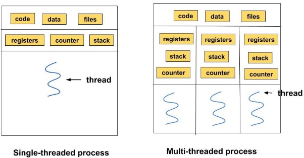

LAPORAN SISTEM OPERASI

**TUGAS CHAPTER 4: THREAD**

Nama	: Fandra Salsabilla Oktorasari

NRP	: 3124500040

Dosen Pengajar	: Dr Ferry Astika Saputra ST, M.Sc

**PROGRAM STUDI D3 TEKNIK INFORMATIKA** 

**POLITEKNIK ELEKTRONIKA NEGERI SURABAYA (PENS)** 

**TAHUN 2024**

Pada model single thread, eksekusi program terjadi secara sekuensial (berurutan) dalam satu alur tugas (thread). Artinya, hanya ada satu tugas yang diproses pada satu waktu, dan tugas berikutnya harus menunggu hingga tugas sebelumnya selesai. Konsep ini sederhana dan mudah dikelola karena tidak ada risiko konflik antarproses. Contohnya adalah program kalkulator atau skrip sederhana yang menjalankan operasi matematika satu per satu. Namun, kelemahannya adalah bottleneck (kemacetan) saat menghadapi tugas berat atau operasi I/O (seperti membaca file besar), karena thread tunggal akan "tertahan" hingga operasi tersebut selesai.

Multithread memungkinkan program menjalankan beberapa alur tugas (thread) secara bersamaan dalam satu proses. Setiap thread dapat bekerja secara independen, sehingga tugas berat atau operasi I/O yang memakan waktu tidak menghalangi thread lain. Misalnya, aplikasi web browser menggunakan multithread: satu thread memuat halaman web, thread lain merespons klik pengguna, dan thread ketiga memutar video. Multithread meningkatkan efisiensi, terutama pada prosesor multi-core, tetapi memerlukan manajemen yang rumit untuk menghindari race condition (konflik data) atau deadlock (kebuntuan thread).
